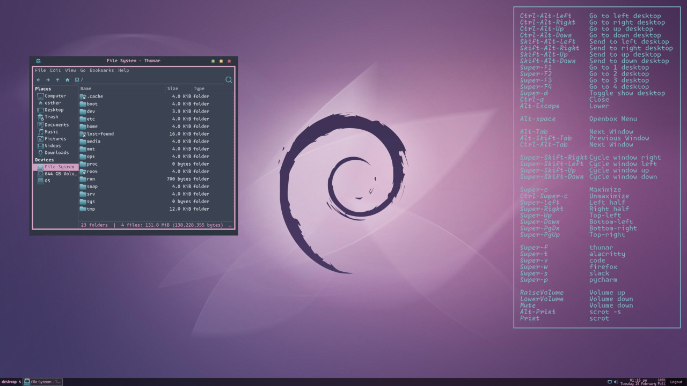

# Transbian

Debian for transbians.



This isn't a distro. It's a few shell scripts, a bunch of config files, and a wallpaper.

What you get:

- A minimalist Debian install with a Crunchbang-ish feel. 
- Transbian is *more* minimal than Crunchbang/BunsenLabs/etc. and doesn't use any forked packages.
- Conky is not included and not needed either. Instead, Transbian just uses Python PIL to generate a conky-like wallpaper.

Design philosophy:

- No popups or notifications (sssshhh)
- Opt for keyboard shortcuts over using the mouse
- I'd rather have a Debian install that works sorta-kinda-OK than a computer that spies on me
- Includes Rust (for the transbians)


## Install

### 1. Install Debian

[Install Debian with the minimal net install](https://www.debian.org/CD/netinst/)

Then, clone this repo. You might need to `apt install git`

### 2. Install Transbian

```bash
./install.sh [OPTIONS]
```

Options:

- `-n` to install NVIDIA drivers
- `-l` to keep LibreOffice (it's part of the minimal net install)
- `-s` to run `screen_layout.sh` on startup (see 2b., below)

### 2b. Set up multiple monitors:

1. Reboot to start an X session: `systemctl reboot`
2. `arandr` (set your displays)
3. Save your layout to: `~/.screenlayout/screen_layout.sh`
4. `./arandr.sh` (Make your layout initialize at the start of a session)
5. Reboot

### 3. Reboot

```bash
systemctl reboot
```

## Rebuild the Wallpaper

The list of hotkeys isn't conky. It's pixels on the wallpaper png.

If you add shortcuts to `rc.xml` and you want to update the wallpaper:

```python
python3 wallpaper.py
```

## Attribution

- See install.sh for the sources of the theme, icons, and fonts
- Wallpaper: http://ubuntucorner.blogspot.com/2014/07/debian-violet-fluid-wallpaper.html